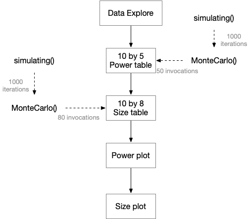

# Documentation of A3 Submission

The project is maintained on github. [Repository](https://github.com/ladychili/MT4113-A3-MonteCarlo) will be made public after due date. 

## Project Structure

- **data** -  dataset and complete workspace

- **figure** - project diagram, all the plots and subplots

- **profiling** -  profile file of the master script

- **report** - pdf report, rmd source, bibliography and related

- **script** - master script, two functions source 

## About Master Script

**Dependency**:

- `tidyverse`

- `snow` - for parallel in `MonteCarlo()`

- `reshape2` - for plot

- `ggpubr` - for plot

Master script conducts the whole workflow and produces all tables and plots shown in report, and it takes around 15 mins to run. The workspace produced by *master.r* is saved as *final.RData* under folder *data*.

**Two things need to be noticed**

- Function `MonteCarlo()` use **three** cores by default to invoke `simulating()` in parallel. 

- Sourcing the whole file *master.r* somehow does not save plots in local properly. Running related code(`pdf()`, `dev.off()`, etc.) line by line does.

**master.R Workflow**

## Functions Documentation

`MonteCarlo()`

Purpose: conduct Monte Carlo simulation, calculate power/size

Inputs:

  - *n* - integer, number of iteration, 1000 by defualt
  
  - *spSize* - integer, sample size for two groups of samples

  - *dat0* - numeric vector of length 2, first element as mean, second element as sd
  
  - *dat1* - numeric vector of length 2, first element as mean, second element as sd
  
  - *rndto* - integer, round observation in to how many decimal place, NULL by default
  
  - *param* - logical, TRUE conduct t test, FALSE conduct M-W test, TRUE by default
  
  - *seed* - numeric, for reproducible purpose, NULL by default
  
  - *core* - integer, how many cores to be used to run in parallel, 3 by default
  
Output: 

  - a number between 0 and 1

---

`simulating()` 

Purpose: simulating dataset for scenarios

Inputs:

  - *seed* - numeric, for reproducible purpose, NULL by default
  
  - *spSize* - integer, sample size for two groups of samples

  - *dat0* - numeric vector of length 2, first element as mean, second element as sd
  
  - *dat1* - numeric vector of length 2, first element as mean, second element as sd
  
Outputs:

  - 2n by 2 dataset, n is sample size

